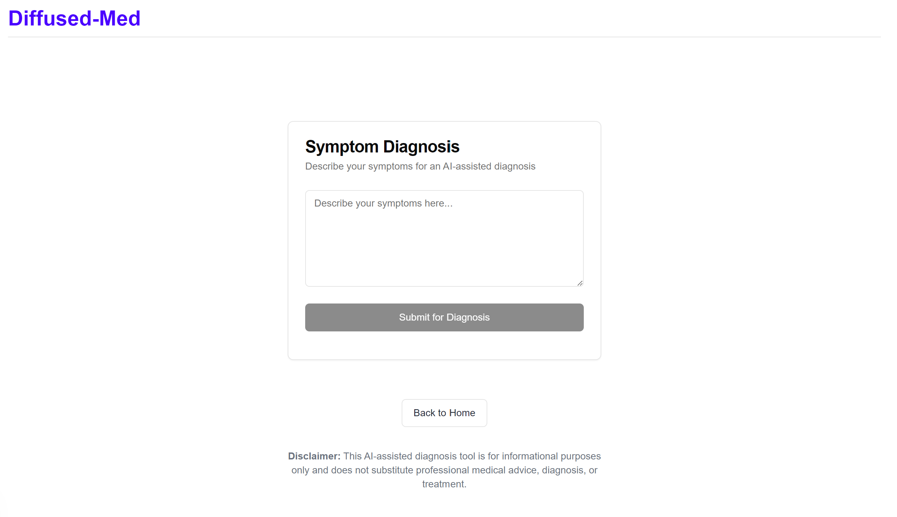
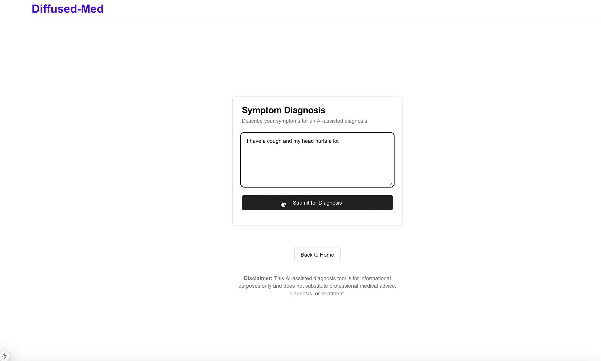
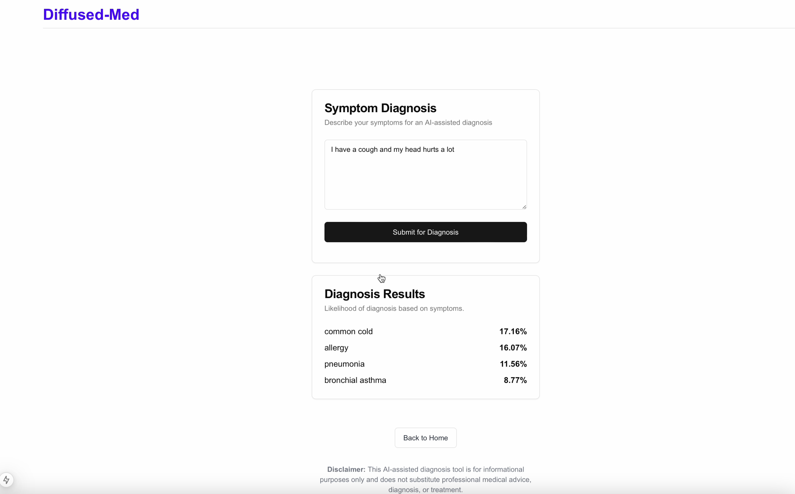
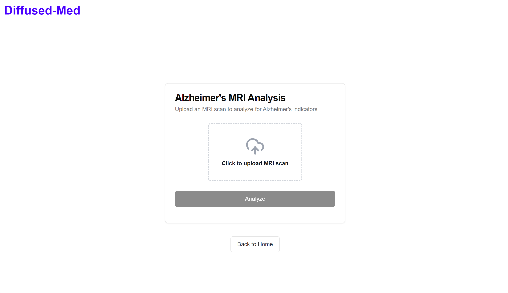
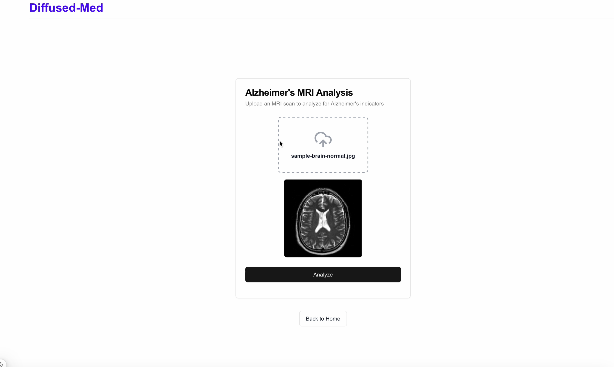
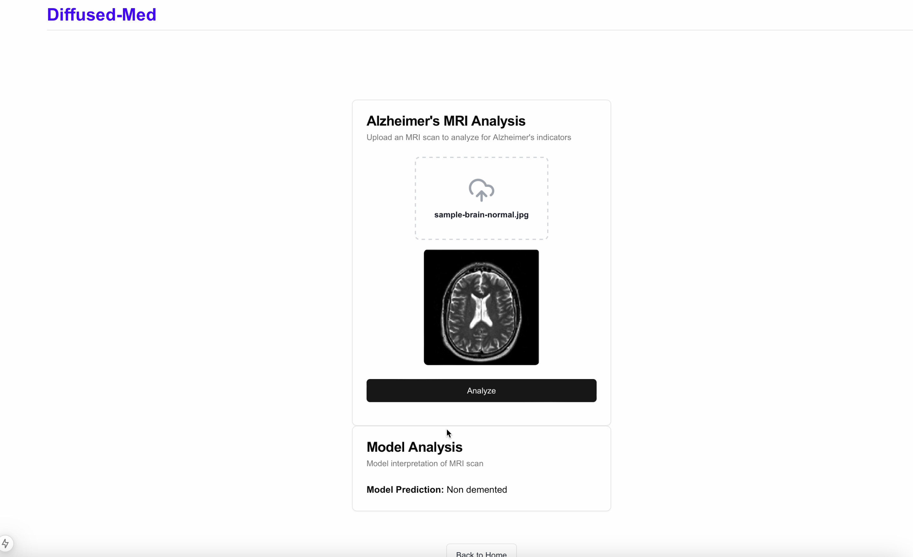

# Decentralized AI Diagnosis Web Application
This web application utilizes **Nillion Decentralized AI** to provide medical image classification and symptom-based diagnosis. The frontend is developed using **Next.js** for a responsive and interactive user experience, while the backend is powered by **Flask**, handling image and symptom data for Nillion-based AI processing.

## Features
- **Automatic Diagnosis**: Given a description of the symptoms, we generate the 3 most likely diagnosis using Nillion's secure TinyBert model. 
- **Alzheimer's identification**: Given a brain MRI scan, we generate a description of the stage of Alzheimer's that the brain is in, using LeNet5. 
- **Translation (TBD)**: Generic translation of text to allow doctors to understand patients from different countries

## Technology Stack
- **Frontend**: Next.js
- **Backend**: Flask
- **AI Model**: Nillion Decentralized AI

## Running the Project

### Prerequisites
- **Unix-based operating system** (Prereq for Nillion)
- **Node.js** and **npm** for Next.js
- **Python 3.x** and **pip** for Flask
- **Nillion** access


### 1. Clone the Repository
```bash
git clone https://github.com/pedro123456789-wq/nillion-med-web-app.git
```
### 2. Change Directory
Change to the correct directory.
```bash
cd diffused-med
```

### 3. Frontend Setup (Next.js)
Run the following to install dependencies, and start the Next.js development server.

```bash
npm install
npm run dev
```

The Next.js app will be running on `http://localhost:3000`.
### 4. Backend Setup (AIVM)
Open a _second shell session_ in terminal and run the following to create a virtual environment, install dependencies, and start the Flask server.

```bash
cd server
python3 -m venv .venv
source .venv/bin/activate 
pip install -r requirements.txt
aivm-devnet
```

### 5. Backend Setup (Flask)
Open a _third_ shell, and run the following to start the Flask server.
```bash
cd server
source .venv/bin/activate 
python server.py
```
The Flask app will be running on `http://localhost:8080`.

### 6. Launch the Web App
Open a browser and visit `http://localhost:3000`. You will see the following landing page. <br><br>


## Automatic Diagnosis
### 1. Navigate to the Diagnosis Page
Click the "Start Diagnosis" button and you'll see the following page.<br><br>


### 2. Describe Symptoms
Write about the symptoms you or your patient has been experiencing and click the submit button.<br><br>


### 3. Get Likely Diagnosis
You'll see the three most likely diagnoses based on the symptoms.<br><br>


## Alzheimer's MRI Analysis

### 1. Navigate to the MRI Analysis Page
Click the "Analyze MRI" button and you'll see the following page.<br><br>


### 2. Upload MRI Scan
Upload an MRI image of a brain. There are sample images in `server/uploads`. <br><br>


### 3. Get the Stage of Dementia
You'll see the stage of Alzheimer's the brain is likely to be in. There are five possible outputs.<br><br>


## License
This project is licensed under the MIT License. See the [LICENSE](LICENSE) file for more details.


## Contributing
Contributions are welcome! Please submit a pull request or open an issue to suggest improvements or report bugs.
